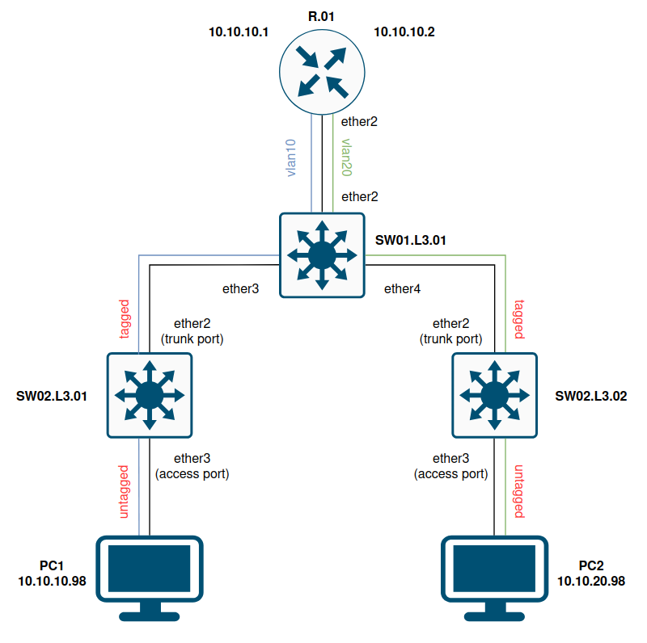
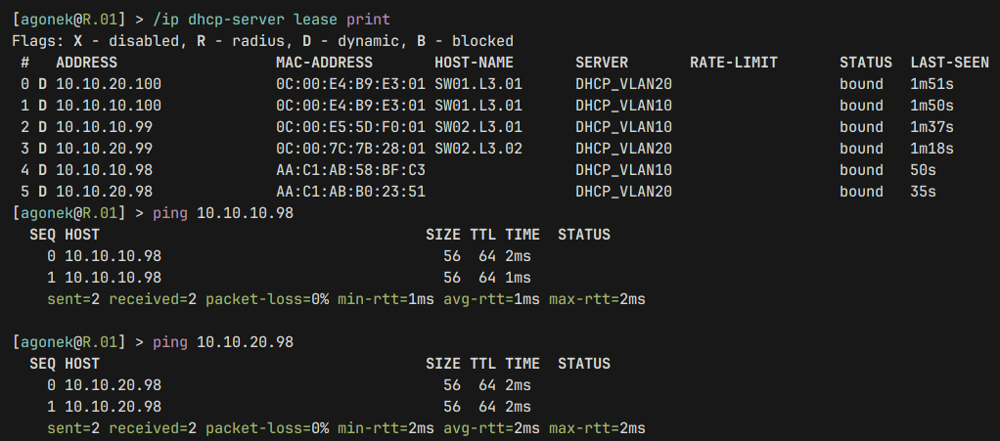
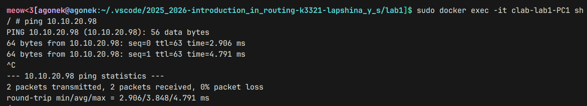

# header
- University: [ITMO University](https://itmo.ru/ru/)
- Faculty: [FICT](https://fict.itmo.ru)
- Course: [Introduction in routing](https://github.com/itmo-ict-faculty/introduction-in-routing)
- Year: 2025/2026
- Group: K3321
- Author: Lapshina Yulia Sergeevna
- Lab: Lab1
- Date of create: 01.09.2025
- Date of finished: 22.09.2025

# 0. prepare

Начальные команды:
- `containerlab deploy` - поднятие лабы
- `ssh admin@192.168.1.х`, `quit` - подключение к роутеру и свитчам
- `sudo docker exec -it clab-lab1-PC1 sh`, `exit` - подключение к пк

Конфигурация лабы:

```
╭───────────────────────────┬───────────────────────────────────┬────────────────────┬────────────────╮
│            Name           │             Kind/Image            │        State       │ IPv4/6 Address │
├───────────────────────────┼───────────────────────────────────┼────────────────────┼────────────────┤
│ clab-lab1-PC1             │ linux                             │ running            │ 192.168.1.6    │
│                           │ alpine:latest                     │                    │ N/A            │
├───────────────────────────┼───────────────────────────────────┼────────────────────┼────────────────┤
│ clab-lab1-PC2             │ linux                             │ running            │ 192.168.1.7    │
│                           │ alpine:latest                     │                    │ N/A            │
├───────────────────────────┼───────────────────────────────────┼────────────────────┼────────────────┤
│ clab-lab1-RO1.TEST        │ vr-ros                            │ running            │ 192.168.1.2    │
│                           │ vrnetlab/mikrotik_routeros:6.47.9 │ (health: starting) │ N/A            │
├───────────────────────────┼───────────────────────────────────┼────────────────────┼────────────────┤
│ clab-lab1-SW01.L3.01.TEST │ vr-ros                            │ running            │ 192.168.1.3    │
│                           │ vrnetlab/mikrotik_routeros:6.47.9 │ (health: starting) │ N/A            │
├───────────────────────────┼───────────────────────────────────┼────────────────────┼────────────────┤
│ clab-lab1-SW02.L3.01.TEST │ vr-ros                            │ running            │ 192.168.1.4    │
│                           │ vrnetlab/mikrotik_routeros:6.47.9 │ (health: starting) │ N/A            │
├───────────────────────────┼───────────────────────────────────┼────────────────────┼────────────────┤
│ clab-lab1-SW02.L3.02.TEST │ vr-ros                            │ running            │ 192.168.1.5    │
│                           │ vrnetlab/mikrotik_routeros:6.47.9 │ (health: starting) │ N/A            │
╰───────────────────────────┴───────────────────────────────────┴────────────────────┴────────────────╯
```

Выделили mgmt сеть для доступа к устройствам, выдали им ip адреса. В image указаны используемые образы, а в kind типы того, что запускается, linux - контейнер, vr-ros - вм с RouterOs внутри контейнера.

# 1. Настройка сетевого оборудования

## Роутер

R.01 - создаем `VLAN10`, `VLAN20`, выдаём интерфейсам ip. Выделяем диапазоны и поднимаем dhcp сервера, настраиваем их сети и шлюзы. Для каждого сетевого устройства также прописаны создание нового пользователя и смена имени:
```
/interface vlan add name=VLAN10 interface=ether2 vlan-id=10
/interface vlan add name=VLAN20 interface=ether2 vlan-id=20
/ip address add address=10.10.10.1/24 interface=VLAN10
/ip address add address=10.10.20.1/24 interface=VLAN20
/ip pool add name=POOL_VLAN10 ranges=10.10.10.2-10.10.10.100
/ip pool add name=POOL_VLAN20 ranges=10.10.20.2-10.10.20.100
/ip dhcp-server add name=DHCP_VLAN10 interface=VLAN10 address-pool=POOL_VLAN10 disabled=no
/ip dhcp-server add name=DHCP_VLAN20 interface=VLAN20 address-pool=POOL_VLAN20 disabled=no
/ip dhcp-server network add address=10.10.10.0/24 gateway=10.10.10.1
/ip dhcp-server network add address=10.10.20.0/24 gateway=10.10.20.1
/system identity set name=R.01
/user add name=agonek group=full password=******
/user remove admin
```

Экспорт конфигурации:

```
[agonek@R.01] > /export
# sep/11/2025 20:34:01 by RouterOS 6.47.9
# software id =
#
#
#
/interface ethernet
set [ find default-name=ether1 ] disable-running-check=no
set [ find default-name=ether2 ] disable-running-check=no
/interface vlan
add interface=ether2 name=VLAN10 vlan-id=10
add interface=ether2 name=VLAN20 vlan-id=20
/interface wireless security-profiles
set [ find default=yes ] supplicant-identity=MikroTik
/ip pool
add name=POOL_VLAN10 ranges=10.10.10.2-10.10.10.100
add name=POOL_VLAN20 ranges=10.10.20.2-10.10.20.100
/ip dhcp-server
add address-pool=POOL_VLAN10 disabled=no interface=VLAN10 name=DHCP_VLAN10
add address-pool=POOL_VLAN20 disabled=no interface=VLAN20 name=DHCP_VLAN20
/ip address
add address=172.31.255.30/30 interface=ether1 network=172.31.255.28
add address=10.10.10.1/24 interface=VLAN10 network=10.10.10.0
add address=10.10.20.1/24 interface=VLAN20 network=10.10.20.0
/ip dhcp-client
add disabled=no interface=ether1
/ip dhcp-server network
add address=10.10.10.0/24 gateway=10.10.10.1
add address=10.10.20.0/24 gateway=10.10.20.1
/system identity
set name=R.01
```
## Центральный свитч

SW01.L3.01 - объединяем порты в мост, прописываем trunk порты. Получаем ip через dhcp клиентов:
```
/interface bridge add name=bridge0 vlan-filtering=yes
/interface bridge port add bridge=bridge0 interface=ether2
/interface bridge port add bridge=bridge0 interface=ether3
/interface bridge port add bridge=bridge0 interface=ether4
/interface bridge vlan add bridge=bridge0 vlan-ids=10 tagged=bridge0,ether2,ether3
/interface bridge vlan add bridge=bridge0 vlan-ids=20 tagged=bridge0,ether2,ether4
/interface bridge vlan print
/interface vlan add name=vlan10 interface=bridge0 vlan-id=10
/interface vlan add name=vlan20 interface=bridge0 vlan-id=20
/ip dhcp-client add interface=vlan10
/ip dhcp-client add interface=vlan20
/ip dhcp-client enable numbers=1
/ip dhcp-client enable numbers=2
/ip dhcp-client print
/system identity set name=SW01.L3.01
/user add name=agonek group=full password=******
/user remove admin
```

Экспорт конфигурации:

```
[agonek@SW01.L3.01] > /export
# sep/11/2025 20:35:47 by RouterOS 6.47.9
# software id =
#
#
#
/interface bridge
add name=bridge0 vlan-filtering=yes
/interface ethernet
set [ find default-name=ether1 ] disable-running-check=no
set [ find default-name=ether2 ] disable-running-check=no
set [ find default-name=ether3 ] disable-running-check=no
set [ find default-name=ether4 ] disable-running-check=no
/interface vlan
add interface=bridge0 name=vlan10 vlan-id=10
add interface=bridge0 name=vlan20 vlan-id=20
/interface wireless security-profiles
set [ find default=yes ] supplicant-identity=MikroTik
/interface bridge port
add bridge=bridge0 interface=ether2
add bridge=bridge0 interface=ether3
add bridge=bridge0 interface=ether4
/interface bridge vlan
add bridge=bridge0 tagged=bridge0,ether2,ether3 vlan-ids=10
add bridge=bridge0 tagged=bridge0,ether2,ether4 vlan-ids=20
/ip address
add address=172.31.255.30/30 interface=ether1 network=172.31.255.28
/ip dhcp-client
add disabled=no interface=ether1
add disabled=no interface=vlan10
add interface=vlan20
/system identity
set name=SW01.L3.01
```

## Промежуточные свитчи

SW02.L3.01 - аналогично с центральным свитчом, но теперь появляются access порты для пк (pvid нужен для привязки нетегированного трафика от пк к vlan10):
```
/interface bridge add name=bridge0 vlan-filtering=yes
/interface bridge port add bridge=bridge0 interface=ether2
/interface bridge port add bridge=bridge0 interface=ether3
/interface bridge vlan add bridge=bridge0 vlan-ids=10 tagged=bridge0,ether2 untagged=ether3
/interface bridge port set pvid=10 numbers=1
/interface vlan add name=vlan10 interface=bridge0 vlan-id=10
/ip dhcp-client add interface=vlan10
/ip dhcp-client enable numbers=1
/system identity set name=SW02.L3.01
/user add name=agonek group=full password=******
/user remove admin

```

Экспорт конфигурации:

```
[agonek@SW02.L3.01] > /export
# sep/11/2025 20:37:05 by RouterOS 6.47.9
# software id =
#
#
#
/interface bridge
add name=bridge0 vlan-filtering=yes
/interface ethernet
set [ find default-name=ether1 ] disable-running-check=no
set [ find default-name=ether2 ] disable-running-check=no
set [ find default-name=ether3 ] disable-running-check=no
/interface vlan
add interface=bridge0 name=vlan10 vlan-id=10
/interface wireless security-profiles
set [ find default=yes ] supplicant-identity=MikroTik
/interface bridge port
add bridge=bridge0 interface=ether2
add bridge=bridge0 interface=ether3 pvid=10
/interface bridge vlan
add bridge=bridge0 tagged=bridge0,ether2 untagged=ether3 vlan-ids=10
/ip address
add address=172.31.255.30/30 interface=ether1 network=172.31.255.28
/ip dhcp-client
add disabled=no interface=ether1
add disabled=no interface=vlan10
/system identity
set name=SW02.L3.01
```

SW02.L3.02 - аналогично SW02.L3.01 за исключениям изменения номера `VLAN`:
```
/interface bridge add name=bridge0 vlan-filtering=yes
/interface bridge port add bridge=bridge0 interface=ether2
/interface bridge port add bridge=bridge0 interface=ether3
/interface bridge vlan add bridge=bridge0 vlan-ids=20 tagged=bridge0,ether2 untagged=ether3
/interface bridge port set pvid=20 numbers=1
/interface vlan add name=vlan20 interface=bridge0 vlan-id=20
/ip dhcp-client add interface=vlan20
/ip dhcp-client enable numbers=1
/system identity set name=SW02.L3.02
/user add name=agonek group=full password=******
/user remove admin
```

Экспорт конфигурации:

```
[agonek@SW02.L3.02] > /export
# sep/11/2025 20:39:18 by RouterOS 6.47.9
# software id =
#
#
#
/interface bridge
add name=bridge0 vlan-filtering=yes
/interface ethernet
set [ find default-name=ether1 ] disable-running-check=no
set [ find default-name=ether2 ] disable-running-check=no
set [ find default-name=ether3 ] disable-running-check=no
/interface vlan
add interface=bridge0 name=vlan20 vlan-id=20
/interface wireless security-profiles
set [ find default=yes ] supplicant-identity=MikroTik
/interface bridge port
add bridge=bridge0 interface=ether2
add bridge=bridge0 interface=ether3 pvid=20
/interface bridge vlan
add bridge=bridge0 tagged=bridge0,ether2 untagged=ether3 vlan-ids=20
/ip address
add address=172.31.255.30/30 interface=ether1 network=172.31.255.28
/ip dhcp-client
add disabled=no interface=ether1
add disabled=no interface=vlan20
/system identity
set name=SW02.L3.02
```
# 2. Получение ip от dhcp-серверов на пк

PC1 - получаем ip от роутера, прописываем маршрут от одной сети к другой:
```
/ # ip a
...
107: eth1@if106: <BROADCAST,MULTICAST,UP,LOWER_UP,M-DOWN> mtu 9500 qdisc noqueue state UP 
    link/ether aa:c1:ab:93:03:a9 brd ff:ff:ff:ff:ff:ff
    inet6 fe80::a8c1:abff:fe93:3a9/64 scope link 
       valid_lft forever preferred_lft forever
/ # udhcpc -i eth1
udhcpc: started, v1.37.0
udhcpc: broadcasting discover
udhcpc: broadcasting select for 10.10.10.98, server 10.10.10.1
udhcpc: lease of 10.10.10.98 obtained from 10.10.10.1, lease time 600
/ # ip a
...
107: eth1@if106: <BROADCAST,MULTICAST,UP,LOWER_UP,M-DOWN> mtu 9500 qdisc noqueue state UP 
    link/ether aa:c1:ab:93:03:a9 brd ff:ff:ff:ff:ff:ff
    inet 10.10.10.98/24 scope global eth1
       valid_lft forever preferred_lft forever
    inet6 fe80::a8c1:abff:fe93:3a9/64 scope link
       valid_lft forever preferred_lft forever
/ # ip route add 10.10.20.0/24 via 10.10.10.1 dev eth1
```
PC2:
Аналогично PC1, за исключением роута - `ip route add 10.10.10.0/24 via 10.10.20.1 dev eth1`.

# 3.  Схема связи, пинги, проверка выдачи ip



Посмотрим на ip, выданные dhcp серверами и попробуем пропинговать оба пк с роутера:



Теперь проверим пинг от PC1 к PC2:



# ?. Полезные ссылки

- [mikrotik vlan doc](https://help.mikrotik.com/docs/spaces/ROS/pages/28606465/Bridge+VLAN+Table)
- [containerlab mikrotik ethers doc](https://containerlab.dev/manual/kinds/vr-ros/#__tabbed_1_1)